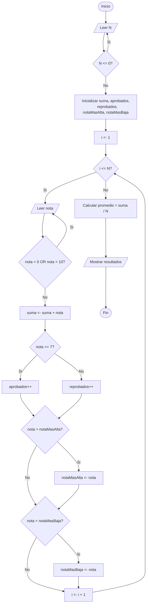

# Ejercicio 1. Control de calificaciones

## Integrantes
- Betancourt Steven
- Ogonaga Isaac 
- Terán Julio 

## Objetivo
Desarrollar un programa en Java que permita ingresar las calificaciones de **N estudiantes** (donde N debe ser mayor que cero y cada calificación debe estar entre 0 y 10) y que determine: el número de estudiantes, la suma de las calificaciones, el promedio general, la cantidad de estudiantes aprobados, la cantidad de reprobados, la nota más alta y la nota más baja.

## Descripción de los ejercicios
El ejercicio consiste en construir un sistema de control de calificaciones para un curso de N estudiantes. El programa debe validar que N sea un valor positivo y que cada calificación ingresada se encuentre en el rango de 0 a 10. Con los datos válidos, el programa procesa la información y presenta un resumen estadístico del curso (suma, promedio, aprobados, reprobados, nota máxima y nota mínima). Se exige el uso de la estructura `while` para las validaciones de entrada y de la estructura `for` para el procesamiento de las N calificaciones.

## Análisis del problema
El problema plantea la necesidad de automatizar el registro y evaluación de las notas de un grupo de estudiantes, evitando errores comunes como el ingreso de un número de estudiantes inválido (cero o negativo) o calificaciones fuera del rango permitido (0 a 10). Para resolverlo, el programa debe primero solicitar y validar la cantidad de estudiantes N, garantizando que sea un valor mayor a cero antes de continuar. Luego, debe recorrer N veces el proceso de solicitar una calificación, validando en cada iteración que el valor esté entre 0 y 10; solo así se puede confiar en los cálculos posteriores. Durante el procesamiento se deben mantener acumuladores (suma total, contador de aprobados, contador de reprobados) y comparadores (nota más alta y nota más baja) que se actualizan en cada iteración. Al finalizar el ciclo, el promedio se obtiene dividiendo la suma total entre N, y con los acumuladores ya calculados se pueden mostrar todos los resultados solicitados. La condición de aprobación utilizada es nota mayor o igual a 7, criterio común en control de calificaciones, aunque puede ajustarse según el contexto académico real.

## Algoritmo
1. Inicio.
2. Solicitar el número de estudiantes N.
3. Mientras N sea menor o igual a 0, volver a solicitar N.
4. Inicializar suma = 0, aprobados = 0, reprobados = 0, notaMasAlta = -infinito, notaMasBaja = +infinito.
5. Para i desde 1 hasta N, hacer:
   1. Solicitar la calificación del estudiante i.
   2. Mientras la calificación sea menor que 0 o mayor que 10, volver a solicitarla.
   3. Sumar la calificación a suma.
   4. Si la calificación es mayor o igual a 7, incrementar aprobados; en caso contrario, incrementar reprobados.
   5. Si la calificación es mayor que notaMasAlta, actualizar notaMasAlta.
   6. Si la calificación es menor que notaMasBaja, actualizar notaMasBaja.
6. Calcular promedio = suma / N.
7. Mostrar N, suma, promedio, aprobados, reprobados, notaMasAlta y notaMasBaja.
8. Fin.

## Pseudocódigo (PSeInt)
```pseint
Algoritmo ControlDeCalificaciones
    Definir n, i, aprobados, reprobados Como Entero
    Definir nota, suma, promedio, notaMasAlta, notaMasBaja Como Real

    suma <- 0
    aprobados <- 0
    reprobados <- 0
    notaMasAlta <- 0
    notaMasBaja <- 10

    Escribir "Ingrese el numero de estudiantes (N > 0):"
    Leer n

    Mientras n <= 0 Hacer
        Escribir "Valor invalido. Ingrese N nuevamente:"
        Leer n
    FinMientras

    Para i <- 1 Hasta n Con Paso 1 Hacer
        Escribir "Ingrese la calificacion del estudiante ", i, " (0 - 10):"
        Leer nota

        Mientras nota < 0 O nota > 10 Hacer
            Escribir "Calificacion fuera de rango. Ingrese un valor entre 0 y 10:"
            Leer nota
        FinMientras

        suma <- suma + nota

        Si nota >= 7 Entonces
            aprobados <- aprobados + 1
        SiNo
            reprobados <- reprobados + 1
        FinSi

        Si nota > notaMasAlta Entonces
            notaMasAlta <- nota
        FinSi

        Si nota < notaMasBaja Entonces
            notaMasBaja <- nota
        FinSi
    FinPara

    promedio <- suma / n

    Escribir "Numero de estudiantes: ", n
    Escribir "Suma de calificaciones: ", suma
    Escribir "Promedio general: ", promedio
    Escribir "Cantidad de aprobados: ", aprobados
    Escribir "Cantidad de reprobados: ", reprobados
    Escribir "Nota mas alta: ", notaMasAlta
    Escribir "Nota mas baja: ", notaMasBaja
FinAlgoritmo
```

## Diagrama de flujo

## Estructuras utilizadas
- **`while`**: utilizada para la validación de datos de entrada (que N sea mayor que cero y que cada calificación esté entre 0 y 10).
- **`for`**: utilizada para el procesamiento de las N calificaciones (recorrido, acumulación de suma, conteo de aprobados/reprobados y comparación de notas máxima/mínima).
- **`if / else`**: utilizada para clasificar cada calificación como aprobada o reprobada, y para actualizar la nota más alta y más baja.

## Casos de prueba

| # | N | Calificaciones ingresadas | Resultado esperado |
|---|---|---------------------------|---------------------|
| 1 | 3 | 0, 7, 10 (caso límite obligatorio) | Suma = 17, Promedio = 5.67, Aprobados = 2, Reprobados = 1, Nota más alta = 10, Nota más baja = 0 |
| 2 | 5 | 8, 6, 9, 5, 7 | Suma = 35, Promedio = 7.0, Aprobados = 3, Reprobados = 2, Nota más alta = 9, Nota más baja = 5 |
| 3 | 1 | 15 → (rechazada) → 10 | El programa debe rechazar el valor 15 por estar fuera de rango y solicitar nuevamente hasta recibir un valor válido (10) |
| 4 | -2 → (rechazado) → 4 | 6, 7, 8, 9 | El programa debe rechazar N = -2 y solicitar nuevamente hasta recibir un valor válido (N = 4) |

> El caso de prueba #1 corresponde al **caso límite obligatorio** solicitado (notas 0, 7 y 10).

## Capturas o evidencias


## Conclusiones
- El uso de la estructura `while` permitió garantizar la integridad de los datos de entrada, evitando que el programa procese valores inválidos de N o de calificaciones.
- La estructura `for` resultó adecuada para el procesamiento repetitivo y controlado de las N calificaciones, ya que el número de iteraciones es conocido de antemano.
- Separar el problema en análisis, algoritmo, pseudocódigo y código facilitó la implementación y redujo errores lógicos antes de escribir el programa en Java.
- El caso límite (notas 0, 7 y 10) permitió comprobar que las condiciones de aprobación/reprobación y los cálculos de nota máxima/mínima funcionan correctamente en los extremos del rango permitido.
