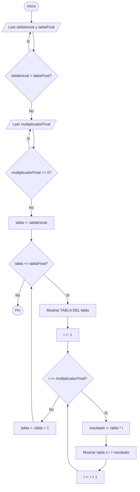

# Ejercicio 2. Tabla de multiplicar configurable

## Integrantes
- Betancourt Steven 
- Ogonaga Isaac 
- Terán Julio 

## Objetivo
Desarrollar un programa en Java que permita al usuario configurar un rango de tablas de multiplicar (tabla inicial y tabla final) y generarlas mediante ciclos `for` anidados, validando que la tabla inicial no sea mayor que la tabla final.

## Descripción de los ejercicios
El ejercicio consiste en solicitar dos números: una **tabla inicial** y una **tabla final**, y generar las tablas de multiplicar de todos los números comprendidos en ese rango (por ejemplo, si la tabla inicial es 3 y la tabla final es 5, el programa debe generar la tabla del 3, la tabla del 4 y la tabla del 5). El programa debe validar que la tabla inicial no sea mayor que la tabla final, y se exige el uso de **ciclos `for` anidados** como estructura obligatoria: un ciclo externo recorre cada tabla del rango y un ciclo interno genera los multiplicadores de esa tabla. Como desafío adicional, el programa permite que el usuario determine también hasta qué multiplicador desea generar las tablas (en lugar de un límite fijo de 10).

## Análisis del problema
Este problema busca generar tablas de multiplicar para un rango de números definido por el usuario, en lugar de una única tabla fija. El programa debe solicitar dos valores: la tabla inicial y la tabla final, y validar que la tabla inicial no sea mayor que la tabla final, ya que de lo contrario el rango no tendría sentido. Una vez validado el rango, el programa debe recorrerlo generando, para cada número dentro de él, su tabla de multiplicar completa; esto requiere dos niveles de repetición: un ciclo externo que recorre cada tabla dentro del rango (desde la inicial hasta la final) y un ciclo interno que recorre los multiplicadores de esa tabla (por defecto del 1 al 10), de ahí la exigencia de usar ciclos `for` anidados. Como desafío adicional, el límite superior del multiplicador (que por defecto sería 10) también puede ser definido por el usuario, lo que agrega una tercera variable de configuración y una validación adicional (que dicho límite sea mayor que cero).

## Algoritmo
1. Inicio.
2. Solicitar la tabla inicial y la tabla final.
3. Mientras la tabla inicial sea mayor que la tabla final, volver a solicitar ambos valores.
4. Solicitar hasta qué multiplicador se desea generar cada tabla (desafío).
5. Mientras el multiplicador final sea menor o igual a 0, volver a solicitarlo.
6. Para tabla desde tablaInicial hasta tablaFinal, hacer:
   1. Mostrar "TABLA DEL [tabla]".
   2. Para i desde 1 hasta multiplicadorFinal, hacer:
      1. Calcular resultado = tabla * i.
      2. Mostrar "[tabla] x [i] = [resultado]".
7. Fin.

## Pseudocódigo (PSeInt)
```pseint
Algoritmo TablaDeMultiplicarConfigurable
    Definir tablaInicial, tablaFinal, multiplicadorFinal, tabla, i, resultado Como Entero

    Escribir "Ingrese la tabla inicial:"
    Leer tablaInicial
    Escribir "Ingrese la tabla final:"
    Leer tablaFinal

    Mientras tablaInicial > tablaFinal Hacer
        Escribir "Error: la tabla inicial no puede ser mayor que la tabla final."
        Escribir "Ingrese la tabla inicial:"
        Leer tablaInicial
        Escribir "Ingrese la tabla final:"
        Leer tablaFinal
    FinMientras

    Escribir "Ingrese hasta que multiplicador desea generar las tablas:"
    Leer multiplicadorFinal

    Mientras multiplicadorFinal <= 0 Hacer
        Escribir "Valor invalido. Ingrese nuevamente:"
        Leer multiplicadorFinal
    FinMientras

    Para tabla <- tablaInicial Hasta tablaFinal Con Paso 1 Hacer
        Escribir "TABLA DEL ", tabla
        Para i <- 1 Hasta multiplicadorFinal Con Paso 1 Hacer
            resultado <- tabla * i
            Escribir tabla, " x ", i, " = ", resultado
        FinPara
    FinPara
FinAlgoritmo
```

## Diagrama de flujo


## Estructuras utilizadas
- **`while`**: utilizada para la validación de datos de entrada (que la tabla inicial no sea mayor que la tabla final, y que el multiplicador final sea mayor que cero).
- **`for` anidados**: un ciclo externo recorre el rango de tablas (desde la tabla inicial hasta la tabla final) y un ciclo interno genera los multiplicadores de cada tabla, tal como lo exige el ejercicio.

## Casos de prueba

| # | Tabla inicial | Tabla final | Multiplicador final | Resultado esperado |
|---|----------------|--------------|----------------------|---------------------|
| 1 | 3 | 5 | 10 | Genera TABLA DEL 3 (3x1=3 ... 3x10=30), TABLA DEL 4 y TABLA DEL 5, cada una del 1 al 10 |
| 2 | 6 | 4 → (rechazado) → 2, 6 | 10 | El programa debe rechazar tablaInicial=6 y tablaFinal=4 (inicial > final) y solicitar nuevamente hasta recibir un rango válido |
| 3 | 2 | 2 | 5 | Genera únicamente TABLA DEL 2, del 1 al 5 (2x1=2 ... 2x5=10) |
| 4 | 7 | 7 | 0 → (rechazado) → 12 | El programa debe rechazar multiplicadorFinal=0 y solicitar nuevamente hasta recibir un valor válido (12), generando TABLA DEL 7 del 1 al 12 |

## Capturas o evidencias


## Conclusiones
- El uso de la estructura `while` permitió garantizar que el rango de tablas y el multiplicador final ingresados sean siempre válidos antes de iniciar la generación de resultados.
- Los ciclos `for` anidados resultaron la estructura adecuada para este problema, ya que se necesitan dos niveles de repetición: uno para recorrer el rango de tablas y otro para recorrer los multiplicadores de cada tabla.
- Separar el problema en análisis, algoritmo, pseudocódigo y código facilitó la implementación y redujo errores lógicos antes de escribir el programa en Java.
- El desafío de permitir configurar el multiplicador final demostró que agregar un parámetro adicional de configuración solo requiere una validación extra, sin modificar la lógica central de los ciclos anidados.
