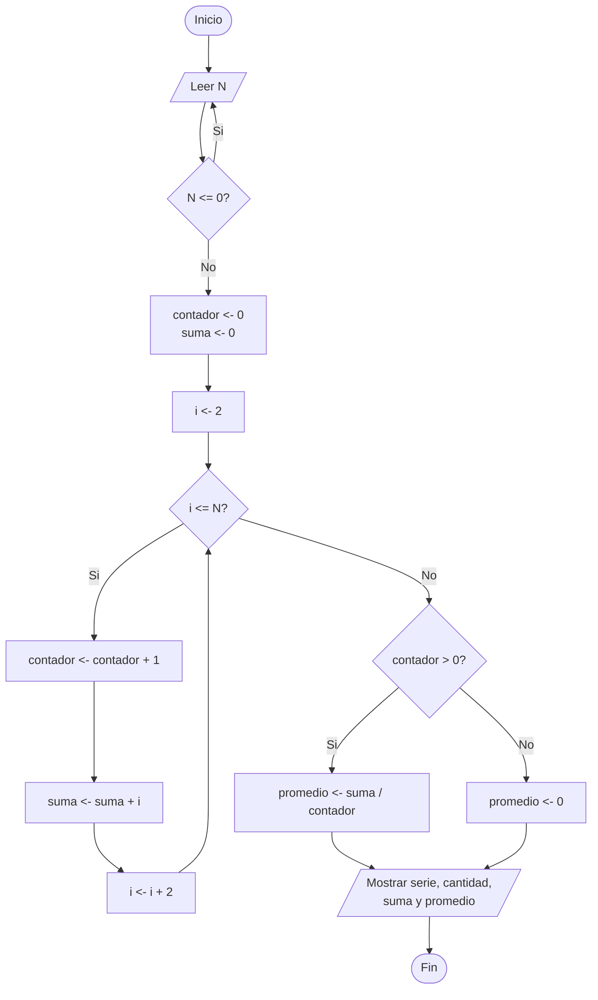

# Ejercicio 3. Serie y suma de números pares

## Integrantes
- Betancourt Steven 
- Ogonaga Isaac 
- Terán Julio 

## Objetivo
Desarrollar un programa en Java que solicite un número entero positivo N y muestre todos los números pares desde 2 hasta N, calculando además la cantidad de pares encontrados, su suma y su promedio.

## Descripción de los ejercicios
El ejercicio consiste en solicitar un número entero positivo **N**, validando que efectivamente sea positivo, y luego generar la serie de números pares comprendidos entre 2 y N (por ejemplo, si N = 12, la serie es 2, 4, 6, 8, 10, 12). Con esa serie se debe calcular la cantidad de números pares generados, la suma total de dichos números y el promedio de los mismos. El ejercicio exige el uso de un **contador** (para contar cuántos pares hay), un **acumulador** (para sumar los valores pares), una **validación** de entrada y la **estructura `for`** para recorrer el rango.

## Análisis del problema
El problema requiere generar y analizar la serie de números pares comprendidos entre 2 y un límite N ingresado por el usuario. Antes de generar la serie, es indispensable validar que N sea un número entero positivo, ya que un valor negativo o igual a cero no tiene sentido como límite superior de la serie. Una vez validado N, se debe recorrer el rango de 2 a N avanzando de dos en dos (2, 4, 6, ...), ya que todos esos valores son pares por construcción; esto permite usar directamente una estructura `for` con paso 2, sin necesidad de verificar si cada número es par. Durante el recorrido se utiliza un contador que se incrementa en cada iteración (para saber cuántos pares existen) y un acumulador que suma cada valor par encontrado (para obtener la suma total). Al finalizar el recorrido, el promedio se calcula dividiendo la suma entre el contador. Es importante considerar el caso límite en que N sea 1, donde no existe ningún número par en el rango (2 a 1 es un rango vacío); en ese caso el contador queda en cero y el promedio no puede calcularse por división normal, por lo que el programa debe manejar esta situación evitando una división por cero.

## Algoritmo
1. Inicio.
2. Solicitar el número entero positivo N.
3. Mientras N sea menor o igual a 0, volver a solicitar N.
4. Inicializar contador = 0 y suma = 0.
5. Para i desde 2 hasta N, con paso 2, hacer:
   1. Incrementar contador en 1.
   2. Sumar i a suma.
   3. Agregar i a la serie a mostrar.
6. Si contador es mayor que 0, calcular promedio = suma / contador; en caso contrario, promedio = 0.
7. Mostrar la serie generada (o un mensaje indicando que no hay pares en el rango).
8. Mostrar la cantidad de pares, la suma y el promedio.
9. Fin.

## Pseudocódigo (PSeInt)
```pseint
Algoritmo SerieYSumaDeNumerosPares
    Definir n, i, contador, suma Como Entero
    Definir promedio Como Real
    Definir serie Como Cadena

    contador <- 0
    suma <- 0
    serie <- ""

    Escribir "Ingrese N (numero entero positivo):"
    Leer n

    Mientras n <= 0 Hacer
        Escribir "Valor invalido. N debe ser un entero positivo. Ingrese N nuevamente:"
        Leer n
    FinMientras

    Para i <- 2 Hasta n Con Paso 2 Hacer
        contador <- contador + 1
        suma <- suma + i
        serie <- serie + ConvertirATexto(i) + " "
    FinPara

    Si contador > 0 Entonces
        promedio <- suma / contador
    SiNo
        promedio <- 0
    FinSi

    Escribir "Serie:"
    Si contador > 0 Entonces
        Escribir serie
    SiNo
        Escribir "No existen numeros pares en el rango de 2 a ", n
    FinSi

    Escribir "Cantidad de pares: ", contador
    Escribir "Suma: ", suma
    Escribir "Promedio: ", promedio
FinAlgoritmo
```

## Diagrama de flujo


## Estructuras utilizadas
- **`while`**: utilizada para la validación de entrada (que N sea un entero positivo).
- **`for`**: utilizada para recorrer el rango de 2 hasta N avanzando de dos en dos, generando así directamente los números pares.
- **Contador**: variable `contador` que se incrementa en cada iteración para saber cuántos números pares se generaron.
- **Acumulador**: variable `suma` que acumula el valor de cada número par encontrado.

## Casos de prueba

| # | N ingresado | Resultado esperado |
|---|--------------|---------------------|
| 1 | 12 | Serie: 2 4 6 8 10 12 — Cantidad de pares = 6, Suma = 42, Promedio = 7.0 |
| 2 | 1 (caso límite) | No existen números pares en el rango de 2 a 1 — Cantidad de pares = 0, Suma = 0, Promedio = 0 |
| 3 | 2 (caso límite) | Serie: 2 — Cantidad de pares = 1, Suma = 2, Promedio = 2.0 |
| 4 | -5 → (rechazado) → 8 | El programa debe rechazar N = -5 por ser negativo y solicitar nuevamente hasta recibir un valor válido (N = 8), generando la serie 2 4 6 8 |

## Capturas o evidencias


## Conclusiones
- El uso de un contador y un acumulador dentro de la estructura `for` permitió calcular de forma simultánea la cantidad de pares y su suma total, sin necesidad de recorrer la serie más de una vez.
- Avanzar el ciclo `for` con paso 2 (empezando en 2) resultó más eficiente que recorrer todos los números y filtrar los pares con una condición adicional.
- La validación con `while` garantizó que el programa solo procese valores de N positivos, evitando resultados incoherentes.
- El caso límite N = 1 evidenció la importancia de controlar la división por cero al calcular el promedio, ya que en ese caso no existen números pares en el rango.zzzzzzzz
